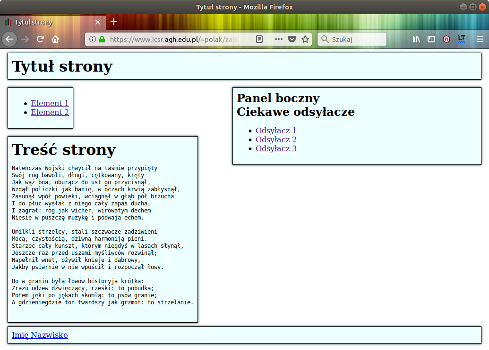

# Kaskadowe arkusze stylów

Wykonaj czynności wstępne dla edytora Visual Studio Code

---

## Sekcja zadań podczas zajęć

#### Zad 1. Język CSS

1. Skopiuj poniższą zawartość do osobnego pliku (HTML)

```html
<!DOCTYPE html>
<html lang="pl">
  <head>
    <meta charset="UTF-8">
    <link rel="stylesheet"
          href="sheet.css"
          media="screen"
          type="text/css">
    <title>
      Tytuł strony
    </title>
  </head>
  <body>
    <header>
      <!-- Page title -->
      <!-- Background color: #EFF -->
      <!-- Border color: #A8A8A8 -->

      <h1>
        Tytuł strony
      </h1>
    </header>

    <nav>
      <!--Tutaj menu nawigacyjne / Here the navigation menu -->
      <!-- left & right margin: 25px -->

      <ul>
        <li>
          <a href="">Element 1</a>
        </li>

        <li>
          <a href="">Element 2</a>
        </li>
      </ul>
    </nav>
    <!-- Tutaj treść panelu bocznego / Here the content of the side panel-->

    <aside>
      <h1>
        Panel boczny
      </h1>

      <h2>
        Ciekawe odsyłacze
      </h2>

      <ul>
        <li>
          <a href="">Odsyłacz 1</a>
        </li>

        <li>
          <a href="">Odsyłacz 2</a>
        </li>

        <li>
          <a href="">Odsyłacz 3</a>
        </li>
      </ul>
    </aside>

    <main>
      <!--Tutaj treść strony / Here the content of the page -->

      <h1>
        Treść strony
      </h1>

      <blockquote>
        Natenczas Wojski chwycił na taśmie przypięty Swój róg bawoli, długi, cętkowany, kręty Jak wąż boa, oburącz do ust go przycisnął, Wzdął policzki jak banię, w oczach krwią zabłysnął, Zasunął wpół powieki, wciągnął w głąb pół brzucha I do płuc wysłał z niego cały zapas ducha, I zagrał: róg jak wicher, wirowatym dechem Niesie w puszczę muzykę i podwaja echem. Umilkli strzelcy, stali szczwacze zadziwieni Mocą, czystością, dziwną harmoniją pieni. Starzec cały kunszt, którym niegdyś w lasach słynął, Jeszcze raz przed uszami myśliwców rozwinął; Napełnił wnet, ożywił knieje i dąbrowy, Jakby psiarnię w nie wpuścił i rozpoczął łowy. Bo w graniu była łowów historyja krótka: Zrazu odzew dźwięczący, rześki: to pobudka; Potem jęki po jękach skomlą: to psów granie; A gdzieniegdzie ton twardszy jak grzmot: to strzelanie.
      </blockquote>
    </main>

    <footer>
      <!-- Tutaj treść stopki / Here the content of the footer -->
      <a href="mailto:your.email.address">Imię Nazwisko</a>
    </footer>
  </body>
</html>
```

2. Obejrzyj dokument w przeglądarce WWW

3. Utwórz plik 'sheet.css' o następującej zawartości

```css
aside  {
  /* Specyfikacja wyglądu */
}
footer {
  /* Specyfikacja wyglądu */
}      
header {
  /* Specyfikacja wyglądu */
}     
main { 
  /* Specyfikacja wyglądu */
}
nav {
  /* Specyfikacja wyglądu */
}
nav ul {
  /* Specyfikacja wyglądu */
}
nav li {
  /* Specyfikacja wyglądu */
}

```

4. (1 pkt) Zmodyfikuj zawartość pliku 'sheet.css' (tutoriale: 1, 2) tak, aby otrzymać stronę WWW o wyglądzie takim jak pokazano poniżej
   - Jak można zauważyć, część z selektorów zawiera własność o takiej samej nazwie i wartości, np. własność ustalająca kolor tła na błękitny

   - Utwórz, w pliku .css, definicję klasy azure, a następnie umieść w niej definicję błękitnego tła, tj. własność z poprzedniego punktu

   - Usuń ze wszystkich selektorów ww. własność — definicja błękitnego tła ma występować, tylko i wyłącznie, w obrębie klasy azure

   - W dokumencie HTML, przypisz wszystkim elementom, które mają mieć błękitne tło, atrybut class w następującej postaci: class='azure'

   - Przyglądnij się zawartości pliku .css i spróbuj samodzielnie wyodrębnić inne, wspólne własności — zidentyfikuj inne, przydatne klasy, a następnie użyj tych klas w dokumencie HTML

