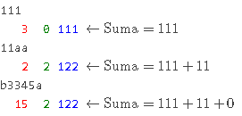

# Podstawy JavaScript

## [Sekcja zadań na zajęcia](toLab)

#### [Zad 1. Wyprowadzanie / wprowadzanie danych](toLab/zad_1)

1. Utwórz dokument HTML zawierający następujący kod

```html
<html>
<body>
<div>Treść dokumentu HTML przed skryptem</div>
<script>
   console.log('Tekst 1');
   window.alert('Tekst 2');
   document.write('Tekst 3');
</script>
<div>Treść dokumentu HTML po skrypcie</div>
</body>
</html>
```

2. Uruchom przeglądarkę WWW, a następnie [otwórz jej konsolę](https://webmasters.stackexchange.com/questions/8525/how-do-i-open-the-javascript-console-in-different-browsers)

3. Załaduj powyższy dokument w bieżącej zakładce przeglądarki WWW

4. Spróbuj zlokalizować miejsce pojawiania się tekstów: Tekst 1, Tekst 2 oraz Tekst 3

5. Utwórz alternatywną wersję dokumentu HTML, w której to skrypt będzie wywoływany po zakończeniu renderowania dokumentu HTML, a nie w 
trakcie (renderowania) — utwórz, a następnie załaduj, następujący dokument HTML:

```html
<html>
<body onLoad="
            console.log('Tekst 1');
            window.alert('Tekst 2');
            document.write('Tekst 3');
          ">
<div>Treść dokumentu HTML</div>
<div>Treść dokumentu HTML</div>
<div>Treść dokumentu HTML</div>
</body>
</html>
```

6. Jak myślisz, dlaczego w tej wersji, treść dokumentu HTML nie jest widoczna w przeglądarce — usuń linię, która jest tego przyczyną

7. Dopisz w ciele dokumentu:

```html
<script>
   window.prompt("Tekst1","Tekst2");
</script>
```
8. Zbadaj, jakie znaczenie mają poszczególne argumenty metody `window.prompt()` i czy są one obowiązkowe

9. Zbadaj, co jest zwracane (wartość, [typ danych](https://developer.mozilla.org/pl/docs/Web/JavaScript/Referencje/Operatory/Operator_typeof)) 
w przypadku:
    - Wprowadzeniu wartości będącej liczbą i naciśnięciu klawisza 'Enter' lub przycisku 'OK' 
    - Wprowadzeniu wartości będącej napisem i naciśnięciu klawisza 'Enter' lub przycisku 'OK' 
    - Niewprowadzeniu wartości i naciśnięciu powyższego klawisza / przycisku 
    - Wprowadzeniu wartości i naciśnięciu przycisku 'Anuluj'

10. Dopisz w obrębie elementu "body"

11. Korzystając z odpowiedniego [obserwatora zdarzeń](https://nafrontendzie.pl/wywolywanie-obsluga-zdarzen-w-javascript/) 
postaci 'onNazwaZdarzenia', kolekcji [DOM 0](https://www.quirksmode.org/js/dom0.html)
, takich jak: [document.forms[]](https://developer.mozilla.org/pl/docs/Web/API/Document/forms) oraz [document.forms[].elements[]](https://developer.mozilla.org/en-US/docs/Web/API/Document/forms#Getting_an_element_from_within_a_form)
, spowoduj, aby po kliknięciu przycisku "Wypisz" wyświetliła się zawartość wprowadzona w polu tekstowym oraz liczbowym formularza

12. Zbadaj, co jest zwracane (wartość, typ danych) w przypadku:
    - Wprowadzeniu wartości będącej liczbą i naciśnięciu powyższego przycisku 
    - Wprowadzeniu wartości będącej napisem i naciśnięciu w/w przycisku 
    - Niewprowadzeniu wartości i naciśnięciu przycisku "Wypisz"

13. Przenieś całą zawartość (kod JS) elementu "script" do osobnego pliku "script.js" (utwórz zewnętrzny skrypt JS), a następnie 
załaduj ten skrypt z poziomu dokumentu HTML
14. 
```html
<form>
   <input name="pole_tekstowe" type="text">
   <input name="pole_liczbowe" type="number">
   <input type="button" value="Wypisz">
</form>
```

#### [Zad 2. Testy](toLab/zad_2)

1. Utwórz dokument HTML o nazwie 'test.html' i poniższej zawartości

```html
<!-- Źródło / Source: https://mochajs.org/#running-mocha-in-the-browser -->
<!DOCTYPE html>
<html lang="en">
<head>
   <meta charset="utf-8">
   <title>
      Mocha tests
   </title>
   <meta name="viewport"
         content="width=device-width, initial-scale=1.0">
   <link rel="stylesheet"
         href="https://unpkg.com/mocha/mocha.css">
</head>
<body>
<div id="mocha">
</div>
<script src="https://unpkg.com/chai/chai.js"></script>
<script src="https://unpkg.com/mocha/mocha.js"></script>
<script class="mocha-init">

   mocha.setup('bdd');
   mocha.checkLeaks();
</script>
<script src="script.js"></script>
<script class="mocha-exec">

   mocha.run();
</script>
</body>
</html>
```

2. Zastąp zawartość pliku 'script.js' następującą:

```js
var expect = chai.expect;

function sum(x,y) {
	return x+y;
}

describe('The sum() function', function() {
 it('Returns 4 for 2+2', function() {
   expect(sum(2,2)).to.equal(4);
 });
 it('Returns 0 for -2+2', function() {
   expect(sum(-2,2)).to.equal(0);
 });
});
```

3. Otwórz dokument 'test.html' w przeglądarce WWW

4. Przeczytaj [opis](https://www.sitepoint.com/unit-test-javascript-mocha-chai/) tworzenia testów w 
oparciu o [Mocha](https://mochajs.org/) oraz [Chai](http://chaijs.com/)

5. Włącz [tryb ścisły](https://marcoos.wordpress.com/2011/01/25/ecmascript-5-strict-mode-tryb-scisly/)
6. Napisz skrypt, który za pomocą metody window.prompt() wczytuje dane (napis), przekazuje je do poniższych funkcji, a następnie wypisuje na bieżąco (po każdym wczytaniu danych):
   `wynik_działania_funkcji_cyfry | wynik_działania_funkcji_litery | wynik_działania_funkcji_suma`

   Przykład działania:

   
   
   Uwagi i informacje:
   - Funkcja cyfry(napis), dla wczytanego napisu, oblicza, a następnie zwraca sumę zawartych w nim cyfr
   - Funkcja litery(napis), oblicza, a następnie zwraca ilość zawartych w nim liter
   - Funkcja suma(napis), oblicza, na bieżąco, sumę wszystkich wczytanych liczb, o ile napis wygląda jak liczba, tzn. rozpoczyna się od ciągu cyfr (patrz linia 3 przykładu) lub zawiera same cyfry (patrz linia 1 przykładu)
   - Wczytywanie danych ma się odbywać do momentu naciśnięcia przycisku 'Anuluj'

7. Zaimplementuj test, w oparciu o Mocha, weryfikujący poprawność działania powyższych funkcji, dla napisów zawierających:
   - Same cyfry
   - Same litery
   - Litery, a po nich cyfry
   - Cyfry, a po nich litery 
   - Pusty napis

#### [Zad 3. Tworzenie dynamicznych grafik](toLab/zad_3)

1. Utwórz dokument HTML o nazwie 'rysunek.html' i poniższej zawartości

```html
<!DOCTYPE html>
<html lang="pl">
  <head>
    <meta charset="UTF-8">
    <title>
      Page title
    </title>
    <script>
        var canvas = document.getElementById('canvas');
        var ctx = canvas.getContext('2d');
        ctx.fillText("Hello World", 10, 50); //Wykreślenie podanego tekstu na płótnie / Drawing given text on canvas
    </script>
  </head>
  <body>
    <main>
      <h1>
        Płótno
      </h1>

      <h1>
        Canvas
      </h1>

      <canvas id="canvas"
              width="200"
              height="300"
              style="border:1px solid #000000;">
        Wygląda na to, że twoja przeglądarka nie obsługuje elementu "canvas" / It looks like your browser does not support the "canvas" element
      </canvas>
    </main>
  </body>
</html>
```

2. Dlaczego na powierzchni [płótna](https://msdn.microsoft.com/pl-pl/library/kurs-html5--canvas--wprowadzenie.aspx) nie pojawił 
się napis "Hello World"? — zobacz jaki komunikat wyświetla się w konsoli przeglądarki WWW `Ctrl+Shift+I`; 
spróbuj wprowadzić odpowiednie modyfikacje, tak aby powyższe instrukcje zadziałały

3. Narysuj trzy figury geometryczne: koło, trójkąt oraz prostokąt

## [Sekcja zadań podczas zajęć](inLab)

Dokument HTML zawiera formularz. Napisz skrypt (1 pkt) oraz towarzyszący mu test Mocha (0.5 pkt.). Założenia dla skryptu
   - Po kliknięciu [przycisku formularza](https://www.w3schools.com/tags/tag_button.asp) skrypt wczytuje dane zawarte w obszarze tekstowym [(textarea)](http://www.kurshtml.edu.pl/html/obszar_tekstowy,formularze.html), korzystając z obiektów/kolekcji 'document.forms' oraz 'elements'
   - Używa kolekcji [indeksowanych](https://developer.mozilla.org/pl/docs/Web/JavaScript/Guide/Indexed_collections) 
   lub kluczowanych ([Map / Set](https://developer.mozilla.org/pl/docs/Web/JavaScript/Guide/Keyed_collections), 
   [SessionStorage / localStorage](https://developer.mozilla.org/pl/docs/Web/API/Web_Storage_API/Using_the_Web_Storage_API)) 
   przechowujących dane typów [prostych](https://pl.wikibooks.org/wiki/JavaScript/Zmienne_i_typy_zmiennych) lub 
   [obiektowych](http://kursjs.pl/kurs/obiekty/obiekty.php)
   - Realizuje funkcjonalność podaną na początku ćwiczeń
   - Wypisuje wynik

## [Sekcja zadań dla Geeków](geek)

#### Stwórz bibliotekę do wizualizacji danych 

1. Bez użycia dodatkowych bibliotek stwórz zestaw funkcji do wizualizacji danych w postaci, wybranych przez Ciebie, dwóch rodzajów wykresów (np. słupkowego, tortowego, ...) — stwórz bibliotekę do tworzenia wykresów

2. Zadbaj o to, aby wykres, zawsze, mieścił się w obszarze płótna (ang. canvas), bez względu na wielkość prezentowanej wartości liczbowej, jak i ekranu użytkownika

3. Staraj się zaimplementować swój skrypt tak, aby dało się go, w przyszłości, używać w innych swoich projektach, np. poprzez odpowiednią parametryzację jego komponentów graficznych

4. Utwórz przykładowe wykresy (statyczne) pokazujące możliwości Twojej biblioteki

5. Pokaż działanie biblioteki dla przypadku danych modyfikowanych "on-line" — na przykład, wykres obrazujący aktualną ilość elementów w poszczególnych kolekcjach (indeksowanych oraz kluczowanych), które zostały utworzone w ramach zadania ćwiczeniowego

6. Przeczytaj opis poświęcony opisowi [modułów JavaScript](https://developer.mozilla.org/en-US/docs/Web/JavaScript/Guide/Modules#applying_the_module_to_your_html)

7. Wprowadź podział na moduły, np.: moduł główny, moduł tworzenia wykresu słupkowego, moduł tworzenia wykresu warstwowego, itp. i zastosuj opisany mechanizm w stworzonej bibliotece