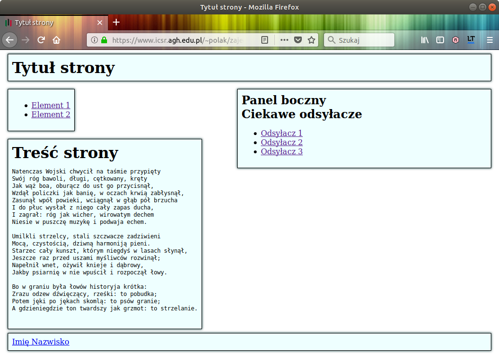
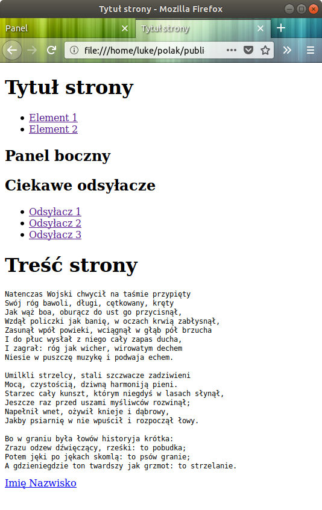

# Standard DOM 4

## [Sekcja zadań na zajęcia](toLab)

#### [Zad.1 Dostęp do stylów](toLab/zad_1)

1. Zmodyfikuj pierwszy przykładowy dokument HTML, który był zamieszczony w jednym z poprzednich konspektów zajęć — 
rozszerz go o formularz zawierający dwa przyciski: "Ustaw" oraz "Skasuj"

2. Stwórz JavaScriptową wersję arkusza 'sheet.css' utworzonego na pierwszych ćwiczeniach — po 
naciśnięciu przycisku "Ustaw" skrypt, korzystając z własności DOM ['style' oraz 'class*'](https://javascript.info/styles-and-classes), 
styluje elementy dokumentu HTML; w rezultacie powinniśmy więc otrzymać stronę o następującym wyglądzie:



3. W przypadku naciśnięcia przycisku "Skasuj", skrypt przywraca oryginalny (początkowy) wygląd strony, tzn. usuwa 
wszystkie style CSS związane z elementami (usuwa stylowanie elementów) — w tym przypadku strona powinna 
wyglądać jak na poniższym zrzucie ekranowym:


<div align="center"></div>

#### [Zad.2 Harmonogramowanie wywołań funkcji](toLab/zad_2)

1. Przeczytaj opis metod: [window.setInterval()](https://developer.mozilla.org/pl/docs/Web/API/Window/setInterval), 
[window.setTimeout()](https://developer.mozilla.org/pl/docs/Web/API/Window/setTimeout), 
[window.requestAnimationFrame()](https://developer.mozilla.org/pl/docs/Web/API/window/requestAnimationFrame) 
oraz [wątków roboczych](https://developer.mozilla.org/en-US/docs/Web/API/Web_Workers_API/Using_web_workers)

2. Wypróbuj [działanie aplikacji](https://mdn.github.io/performance-scenarios/js-worker/) przedstawionej w artykule 
[Intensive JavaScript](https://firefox-source-docs.mozilla.org/devtools-user/performance/scenarios/intensive_javascript/) 
— zidentyfikuj, opisane tam, "wąskie gardła" aplikacji

3. Utwórz formularz zawierający:
    - Przycisk Start
    - Przycisk Stop 
    - Pole liczbowe delay

4. Napisz skrypt zawierający:
   - Dwie globalne tablice: `SetIntervalTime` oraz `SetTimeoutTime`
   - Dwie funkcje obciążające: `doTimeConsumingCallculationsWithSetInterval()` oraz `doTimeConsumingCallculationsWithSetTimeout()` —
   każda z nich ma wykonywać poniższy algorytm:
     1. [Dodaj](https://alligator.io/js/push-pop-shift-unshift-array-methods/) do prawego końca tablicy, odpowiednio: 
     `SetIntervalTime` / `SetTimeoutTime` , wynik wykonania metody [performance.now()](https://developer.mozilla.org/docs/Web/API/Performance/now)
     2. Jeżeli długość tablicy jest większa niż N (zmienna globalna w skrypcie), to [usuń](https://alligator.io/js/push-pop-shift-unshift-array-methods/) pierwszy element tablicy
     3. Wykonaj kod zawierający intensywne obliczenia, np. wywołaj funkcję [calculatePrimes(1000, 1000000000)](https://developer.mozilla.org/en-US/docs/Tools/Performance/Scenarios/Intensive_JavaScript#js-blocking-overview) — 
     jej implementacja znajduje się w powyższym artykule
   - Funkcję wizualizacyjną `drawChart()` , która:
     1. Bazując na danych zawartych w obydwu tablicach, oblicza średnią z różnic SetXxxTime[i+1]-SetXxxTime[i] — średni czas cyklicznego wywołania funkcji obciążających
     2. Wizualizuje obydwie średnie na jednym wykresie — użyj [CanvasJS](https://canvasjs.com/) (ewentualnie 
     [dowolnej innej](https://www.sitepoint.com/best-javascript-charting-libraries/) służącej do tworzenia wykresów)
   - Funkcję `start()` , która (po naciśnięciu przycisku Start):
     1. Uruchamia cykliczne wywoływanie funkcji obciążającej `doTimeConsumingCallculationsWithSetInterval()` — należy 
     wywołać metodę `window.setInterval(doTimeConsumingCallculationsWithSetInterval, M)`
     2. Uruchamia cykliczne działanie funkcji obciążającej `doTimeConsumingCallculationsWithSetTimeout()` — wywołaj 
     metodę `window.setTimeout(doTimeConsumingCallculationsWithSetTimeout, M)` z ciała funkcji `start()` oraz umieść 
     jej wywołanie w ostatniej linii funkcji obciążającej `doTimeConsumingCallculationsWithSetTimeout()` — zapętlij 
     wywołanie funkcji obciążającej
     
     ```js
     function start() {
     ...
     window.setTimeout(doTimeConsumingCallculationsWithSetTimeout, M);
     ...
     }
     function doTimeConsumingCallculationsWithSetTimeout() {
     ...
     window.setTimeout(doTimeConsumingCallculationsWithSetTimeout, M); // ⇔ window.setTimeout(arguments.callee, M);
     }
     ```
     3. Uruchamia cykliczne działanie funkcji wizualizacyjnej `drawChart()` — użyj metody `window.requestAnimationFrame(drawChart)` 
     w funkcji `start()`, a następnie wstaw wywołanie tej metody w ostatniej linii funkcji wizualizacyjnej
     
     ```js
     function start() {
     ...
     window.requestAnimationFrame(drawChart);
     ...
     }
     function drawChart() {
     ...
     window.requestAnimationFrame(drawChart); // ⇔ window.requestAnimationFrame(arguments.callee);
     }
     ```
   - Funkcję `stop()` , która (po naciśnięciu przycisku Stop) zatrzymuje proces cyklicznego działania funkcji: wizualizacyjnej oraz obciążających

5. Zaobserwuj
    - Czy obydwie średnie mają zbliżoną, czy znacząco różniącą się wartość?
    - Czy w przypadku użycia `setInterval(funkcjaObciążająca, opóźnienie)` bądź `setTimeout(funkcjaObciążająca, opóźnienie)`, 
   czas pomiędzy kolejnymi wykonywaniami kodu funkcjaObciążająca jest zawsze taki, jak określono w parametrze 
   opóźnienie (w polu delay formularza)? Spróbuj wywnioskować, czy kod funkcjaObciążająca jest wykonywany w osobnym, 
   czy w głównym wątku — swoje obserwacje porównaj z informacjami zawartymi w [artykule](https://johnresig.com/blog/how-javascript-timers-work/)

#### [Zad.3 Użycie DOM](toLab/zad_3)

1. Stwórz dokument HTML składający z: formularza oraz wielu (np. 10) elementów [span](http://www.kurshtml.edu.pl/html/span,html.html)
zawierających cyfrę 0, tj. `<span>0</span>`. W oparciu o standard [HTML DOM](https://www.w3schools.com/js/js_htmldom.asp) 
napisz skrypt o następujących założeniach:
   - Skrypt cyklicznie, co sekundę, dekrementuje wartość zmiennej aż do osiągnięcia wartości 0
   - Wypisuje jej, aktualną, wartość w obrębie każdego z elementów span
   - Osiągnięcie wartości 0 ma nie wstrzymywać cyklicznego wykonywania kodu — ma się wykonywać pusty / jałowy kod
   - Wartość początkową dekrementowanej zmiennej określa użytkownik za pomocą pola tekstowego (formularza) 
   opatrzonego identyfikatorem 'licznik', a [wartością domyślną](https://www.w3schools.com/tags/att_input_value.asp) 
   wyświetlaną w tym polu ma być 10. Gdy wartość zmiennej osiągnie 0, to zawartością pola tekstowego też ma być 0
   - Gdy użytkownik wpisze wartość większą od 0, to ponownie ma wykonywać się cykliczna dekrementacja
   - Dostęp do treści elementów span oraz pola tekstowego ma się odbywać przy użyciu metody 
   [document.getElementById()](https://developer.mozilla.org/pl/docs/Web/API/Document/getElementById), 
   [document.querySelector()](https://developer.mozilla.org/pl/docs/Web/API/Document/querySelector), 
   [document.getElementsByTagName()](https://developer.mozilla.org/pl/docs/Web/API/Document/getElementsByTagName) lub 
   [document.querySelectorAll()](https://developer.mozilla.org/pl/docs/Web/API/Document/querySelectorAll)
   - Modyfikowanie treści dokumentu HTML może się odbywać, tylko i wyłącznie, w oparciu o API DOM 4, 
   czyli przykładowo nie można używać [innerHTML](https://developer.mozilla.org/pl/docs/Web/API/Element/innerHTML), będącego częścią DOM 0

2. Utwórz alternatywną wersję skryptu — zamiast elementów span mamy komponenty webowe ([wprowadzenie](https://kot-zrodlowy.pl/javascript/2019/07/18/web-components-wprowadzenie.html),
[opis 1](https://fsgeek.pl/post/czym-sa-web-components/), [opis 2](https://developers.google.com/web/fundamentals/web-components/)), 
a każdy z nich (niezależnie) odczytuje, a następnie wyświetla, aktualną wartość (dekrementowanej) zmiennej. W tym przypadku 
komponenty, ale tylko one, mogą korzystać z własności innerHTML Wskazówki:
   - Komponenty są niezależne, a więc w naszym przypadku, każdy z nich, niezależnie od pozostałych, modyfikuje swój licznik / zmienną i każdy z nich używa odrębnej funkcji do harmonogramowania wywołania kodu 
   - Artykuły: opisujący [wady oraz zalety technologii "Web Components"](https://blog.logrocket.com/what-happened-to-web-components/) 
   oraz porównujący [komponenty webowe z React](https://blog.logrocket.com/react-vs-web-components/) 
   - [Przykład "Hello World"](https://apimeister.com/2017/06/03/writing-a-hello-world-web-component.html)

- Pomocne linki:
  - [The State of Web Components - Ana Cidre - CityJS Conf 2020](https://youtu.be/xMGRF6pE764)
  - [How to create a Web Component using Vanilla JS](https://youtu.be/vLkPBj9ZaU0)
  - [How to create a web component in React](https://youtu.be/PUGDzA1uP-Y\)
  
## [Sekcja zadań podczas zajęć](inLab)

Napisz skrypt, który:
- Modyfikuje treść / zawartość dokumentu HTML używając standardu DOM 4
- Obsługuje zdarzenia za pomocą odpowiedniego obserwatora zdarzeń
- Implementuje funkcjonalność określoną na początku ćwiczeń

## [Sekcja zadań dla Geeków](geek)

W oparciu o tutorial napisz grę przeglądarkową:
- Rozgrywka odbywa się w obrębie płótna "canvas" lub w obrębie całej strony WWW
- Sterowanie odbywa się myszką lub przy pomocy klawiatury
- Na planszy gry znajdują się dwa typy kwadratów: zielony (gracz zdobywa punkty dodatnie) oraz czerwony (gracz zdobywa punkty ujemne)
- Po planszy, z jednostajną prędkością, porusza się koło
- Zmiana kierunku poruszania się koła odbywa się za pomocą myszy lub klawiatury
- Na początku gry, w losowych pozycjach oraz ilościach, pojawiają się, nieruchome, zielone kwadraty zawierające licznik odliczający od 20 w dół
- Jeżeli wartość licznika stanie się liczbą ujemną, to kolor kwadratu ulega zmianie na czerwony
- Każdy kwadrat ma czas życia, po którego upływie znika on z planszy gry, a zamiast niego pojawia się, w losowej pozycji, nowy kwadrat (zielony)
- Zadaniem gracza jest sterowanie kołem w taki sposób aby zderzyło się z kwadratem. Gdy tego dokona, dostaje tyle punktów (dodatnich lub ujemnych) ile wskazuje licznik (w kwadracie)
- Po uderzeniu w kwadrat kierunek ruchu koła nie ulega zmianie — koło przenika przez kwadrat
- Na stronie mają być widoczne dwie tabele HTML — ich elementy mają być modyfikowane na bieżąco:
    - Tabela wyświetlająca aktualną ilość punktów oraz czas do zakończenia gry
    - Tabela wyświetlająca nazwiska trzech osób z największą liczbą punktów — trzy ostatnie rekordowe wyniki
- Gra ma się składać z trzech etapów. W każdym z nich mają ulegać zwiększeniu:
    - ilość kwadratów
    - prędkość ruchu koła
    - prędkość zmiany wartości licznika
- Ww. parametry oraz nazwisko gracza określa się za pomocą formularza lub za pomocą okna wprowadzania danych, przed rozpoczęciem gry
- Każdy etap gry ma trwać 60 sekund
- Koło, które opuszcza planszę gry, ma się pojawić z drugiej strony

**Uwagi**
- Plansza gry oraz poszczególne tabele mają być komponentami webowymi lub React.
- Komponenty nie powinny ze sobą bezpośrednio komunikować, ale mogą to robić w sposób pośredni — w naszym przypadku, sugerowanymi rozwiązaniami są:
    - Wysłanie oraz odbiór danych przy wykorzystaniu modelu zdarzeniowego:
        - [Utworzenie](https://developer.mozilla.org/pl/docs/Web/Guide/Events/Creating_and_triggering_events) własnego 
      zdarzenia przy użyciu interfejsu [CustomEvent](https://developer.mozilla.org/pl/docs/Web/API/CustomEvent)
        - Rejestracja obserwatora zdarzenia — wywołanie [addEventListener()](https://developer.mozilla.org/pl/docs/Web/API/Element/addEventListener)
        - Wysłanie danych — wywołanie [dispatchEvent()](https://developer.mozilla.org/pl/docs/Web/API/Element/dispatchEvent)
        - Odbiór danych przez obserwatora zdarzenia
    - Przekazanie (w obrębie obserwatora zdarzenia) odebranych danych do komponentu odbiorczego za pomocą publicznych własności
- Do animacji obiektów, wskazane jest użycie `requestAnimationFrame()`, zamiast `setTimeout()` / `setInterval()`
- Grę należy stworzyć w "czystym JS", tj. w oparciu o framework [Vanilla JS](http://vanilla-js.com/), bez użycia bibliotek typu: JQuery, MooTools, Phaser, itp.
- O ile to możliwe, proszę zapewnić responsywność — użytkownicy smartfonów też powinni mieć możliwość grania ☺
- Można zdobyć dodatkowy punkt (+1 pkt.), jeżeli gra będzie korzystać z biblioteki typu "[2D physics engine](https://github.com/bebraw/jswiki/wiki/Physics-libraries)", 
np.: [Box2DJS](http://box2d-js.sourceforge.net/) lub [PhysicsJS](http://wellcaffeinated.net/PhysicsJS/), dzięki czemu obiekty będą się poruszały zgodnie z prawami fizyki; przykładowo, rozbuduj grę o niektóre z poniższych możliwości:
  - Koło odbija się od kwadratów
  - Po uderzeniu w kwadrat, pozycja tego kwadratu ulega przesunięciu oraz obróceniu
  - Jeżeli kwadrat uderzy w krawędź planszy gry to się odbija (od krawędzi) oraz obraca się
  - Jeżeli kwadrat uderzy w inny kwadrat, to pozycja uderzonego ulega przesunięciu oraz obróceniu


