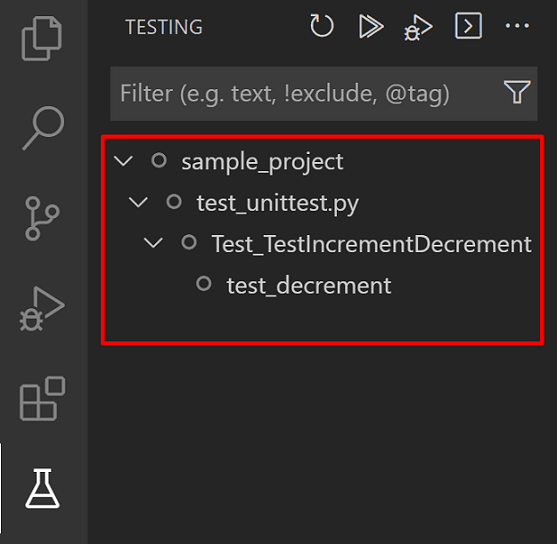

# Środowisko uruchomieniowe 'Node.js'

## Sekcja zadań na zajęcia

#### [Zad 1. Moduły](toLab/zad_1)

1. [Skonfiguruj](https://www.icsr.agh.edu.pl/~polak/jezyki/js/#cw4) edytor Visual Studio Code

2. Utwórz, w katalogu 'cw4', skrypt (główny) o nazwie 'index.js' zawierający [klasę](https://kursjs.pl/kurs/obiekty/class.php) 
Operation. Składniki klasy:
   - Dwie własności: x oraz y
   - Dwuargumentowy konstruktor przypisujący ww. własnościom dane początkowe
   - Metoda `sum()`, która oblicza, a następnie zwraca x+y

3. Umieść w ww. skrypcie fragment kodu wypisujący wynik sumowania liczb dla ustalonych (przez Ciebie) wartości x, y

4. Uruchom skrypt za pomocą komendy `node index`, `node .` lub naciśnij `Ctrl+Alt+R`

5. Sprawdź, czy jest możliwe utworzenie obiektu przed definicją klasy

6. Przenieś definicję klasy do osobnego pliku o nazwie 'module.js' — w skrypcie głównym ma zostać tylko kod wypisujący wynik sumowania liczb

7. W pierwszej linii pliku 'index.js' umieść `const module = require('./module');`, a następnie [spowoduj](https://nodejs.org/dist/latest/docs/api/modules.html#modules_modules)
, aby skrypt nadal działał, tzn. po wykonaniu komendy `node index` wypisywał wynik operacji x+y

8. Stworzony (powyżej) moduł to moduł typu "CommonJS". [Skonwertuj go](https://blog.logrocket.com/es-modules-in-node-js-12-from-experimental-to-release/#modulesinnodejscurrentstate)
(ręcznie) do modułu typu "[ES6](http://kursjs.pl/kurs/es6/moduly.php)", a następnie użyj tego modułu w skrypcie głównym — być może będzie 
to wymagać zmiany rozszerzenia nazwy pliku

9. Przeczytaj [fragment artykułu](https://kursjs.pl/kurs/es6/node.php#npx) poświęcony poleceniu `npx`

10. Utwórz podkatalog 'cw4/test'

11. Utwórz w nim plik o nazwie 'test1.js' i następującej zawartości:

```js
/*
  Mocha allows you to use any assertion library you wish. In this example, we are using the built-in module called 'Assert'.
  If you prefer the 'Chai' library (https://www.chaijs.com/) then you have to install it yourself: 'npm install chai --save-dev',
  and then you need to uncomment the lines below.
*/

//----------------------------------------
// Mocha tests with CommonJS style imports
//----------------------------------------

// var expect = require('chai').expect;
var assert = require('assert');
var module = require('../module');

describe('The sum() method', function () {
  it('Returns 4 for 2+2', function () {
    var op = new module.Operation(2, 2);
    assert.strictEqual(op.sum(), 4)
    // expect(op.sum()).to.equal(4);
  });
  it('Returns 0 for -2+2', function () {
    var op = new module.Operation(-2, 2);
    assert.strictEqual(op.sum(), 0)
    // expect(op.sum()).to.equal(0);
  });
});

//-----------------------------------
// Mocha tests with ES6 style imports
//-----------------------------------

/*
- You must install the 'esm' module (https://www.npmjs.com/package/esm) — npm install esm --save-dev
- You must run tests as follows: npx mocha --require esm
Source: https://stackoverflow.com/questions/57004631/mocha-tests-with-es6-style-imports

import { Operation } from "../module";
import assert from 'assert';

describe('The sum() method', function () {
  it('Returns 4 for 2+2', function () {
    var op = new Operation(2, 2);
    assert.strictEqual(op.sum(), 4)
  });
  it('Returns 0 for -2+2', function () {
    var op = new Operation(-2, 2);
    assert.strictEqual(op.sum(), 0)
  });
});
*/
```

12. Zainstaluj wtyczkę ["ES6 Mocha Snippets"](https://marketplace.visualstudio.com/items?itemName=spoonscen.es6-mocha-snippets) dla Visual Studio 
Code — wykonaj komendę: `code --install-extension spoonscen.es6-mocha-snippets`

13. Obejrzyj jej [demo](https://marketplace.visualstudio.com/items?itemName=spoonscen.es6-mocha-snippets), a następnie wypróbuj niektóre z oferowanych, przez nią, snippetów

14. Z poziomu katalogu 'cw4', uruchom test za pomocą komendy `npx mocha`
   - Powyższa komenda spowoduje zainstalowanie (w podkatalogu wymienionym w ["How can I clear the central cache for `npx`?"](https://stackoverflow.com/questions/63510325/how-can-i-clear-the-central-cache-for-npx)),
a następnie uruchomienie programu mocha
   - Jeżeli komenda 'npx' nie jest dostępna, to:
      - Zainstaluj (samodzielnie) framework [Mocha](https://mochajs.org/): `npm install mocha --save-dev` — w tym przypadku program mocha zostanie zainstalowany w podkatalogu './node_modules/mocha/bin'
      - Uruchom test za pomocą komendy `node ./node_modules/mocha/bin/mocha`

15. Zainstaluj wtyczkę ["Mocha sidebar"](https://marketplace.visualstudio.com/items?itemName=maty.vscode-mocha-sidebar) dla Visual Studio Code — 
wykonaj komendę: `code --install-extension maty.vscode-mocha-sidebar`

<div align="center"></div>

16.Obejrzyj jej [demo](https://marketplace.visualstudio.com/items?itemName=maty.vscode-mocha-sidebar), a następnie uruchom, za jej 
pomocą, test z poziomu Visual Studio Code

17.Zmodyfikuj skrypt 'index.js' — wartości parametrów x oraz y mają być przekazywane z poziomu linii komend — `node index 2 7`

18. Wzbogać kod źródłowy modułu (klasa Operation, metoda `sum()` oraz konstruktor) o 
[komentarze dokumentacyjne](http://usejsdoc.org/about-getting-started.html) programu [JSDoc](https://www.npmjs.com/package/jsdoc)

19. Wygeneruj dokumentację korzystająć z komendy `npx jsdoc module.js`

#### [Zad 2. Moduł 'fs'](toLab/zad_2)

Napisz:
- Skrypt, który korzystając z modułu [fs](https://nodejs.org/api/fs.html), dla podanego w linii komend napisu, 
wyświetla informację czy reprezentuje on nazwę (istniejącego) pliku, czy katalogu. Jeżeli jest to plik, to korzystając 
z funkcji w wersji **synchronicznej** (`fs.*Sync(...)`), ma on wypisać jego zawartość
- Utwórz plik 'test/test2.js' zawierający test weryfikujący poprawność działania tej implementacji

#### [Zad 3. Moduł 'http'](toLab/zad_3)

## [Sekcja zadań podczas zajęć](inLab)

## [Sekcja zadań dla Geeków](geek)

